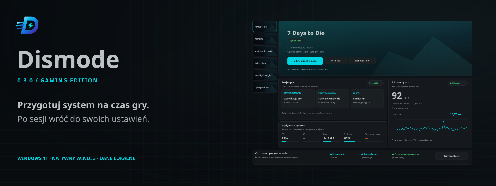
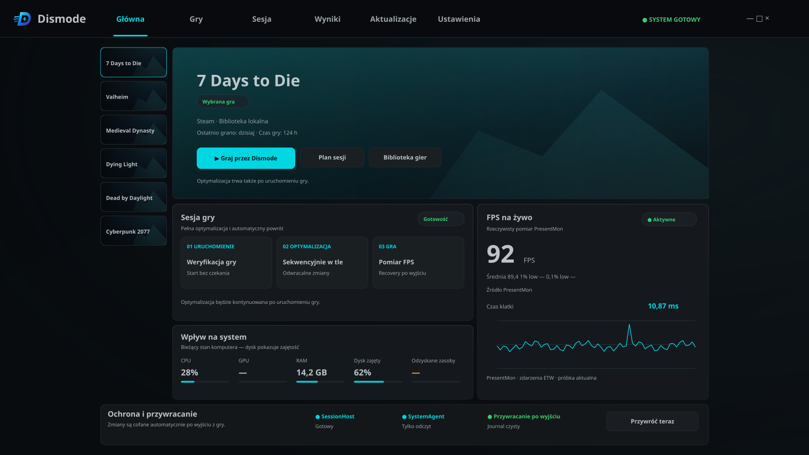
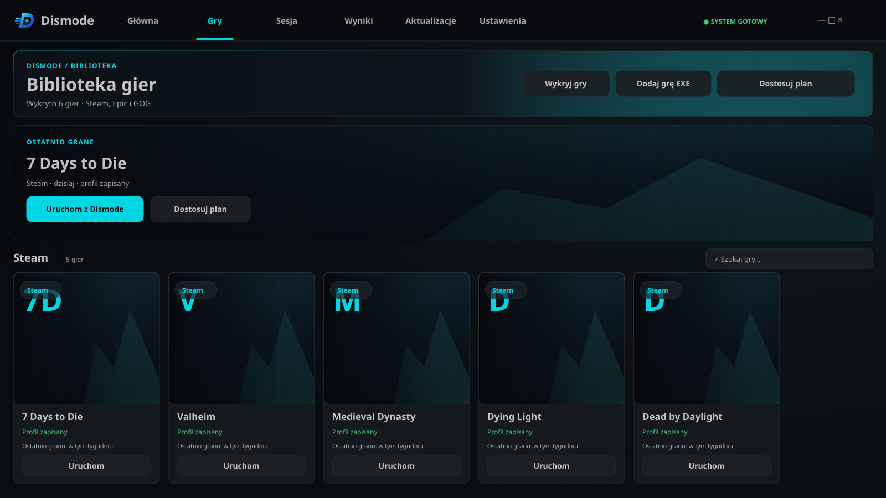
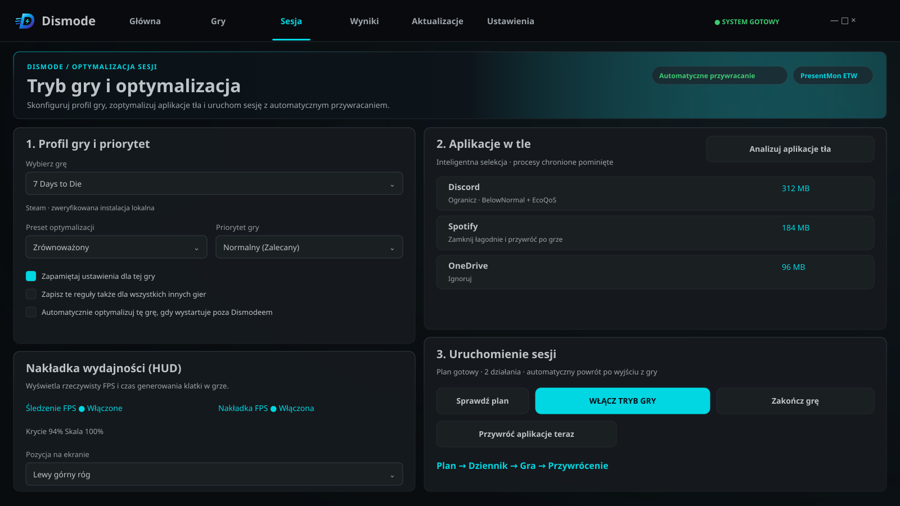
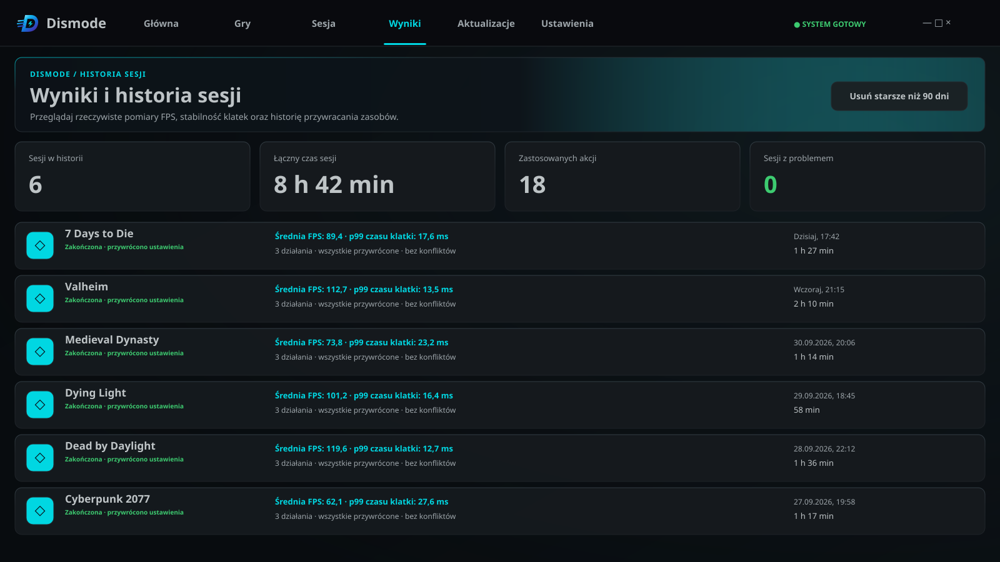
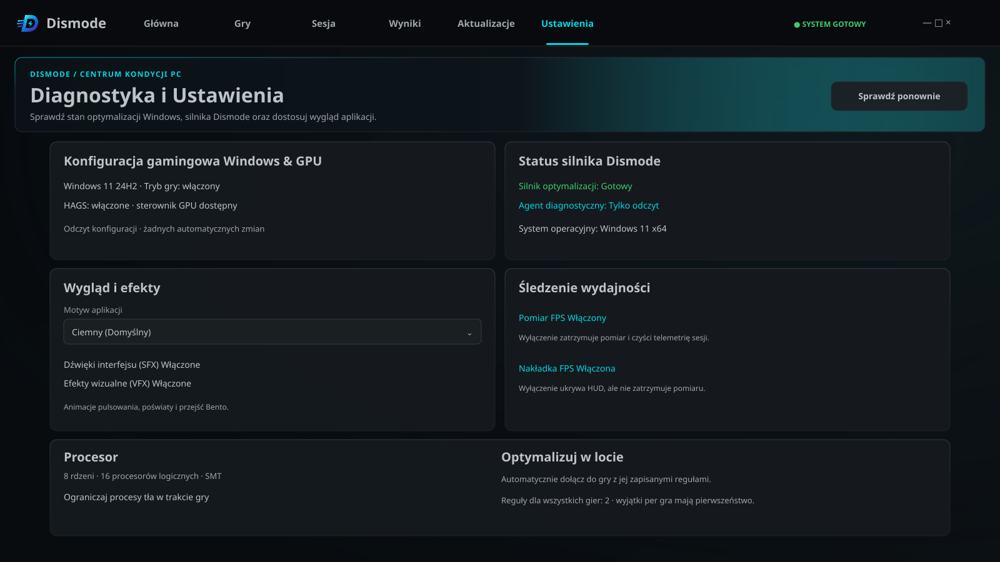
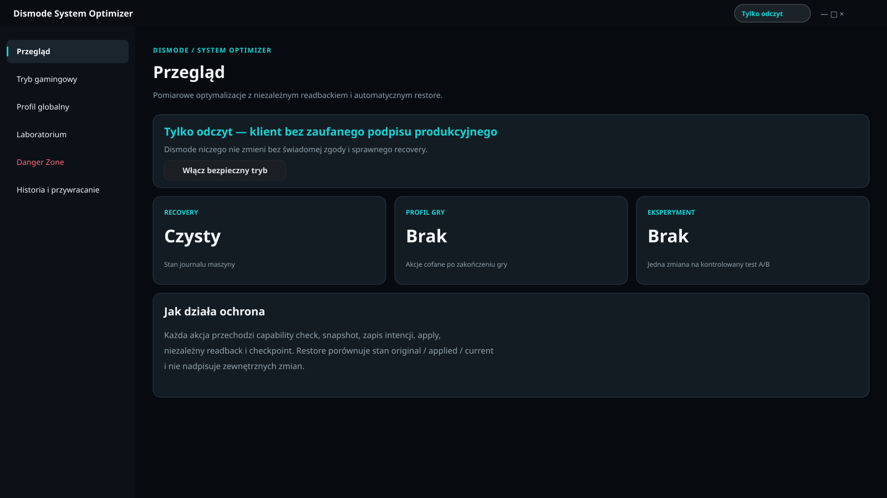
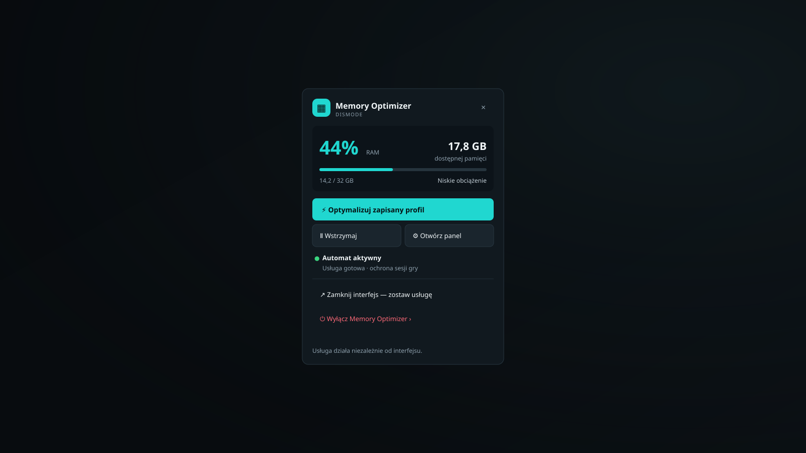

<p align="center"></p>

# Dismode 0.8.0 Gaming Edition

Natywny optymalizator sesji gry dla Windows 11: pokazuje plan zmian, mierzy FPS i przywraca poprzedni stan po zakończeniu gry.

[](https://github.com/Dismonder/Dismode/releases/latest)
[](installer/LICENSE-PL.txt)


[](https://github.com/Dismonder/Dismode/releases/latest)

Plik: **`Dismode-Setup-0.8.0-win-x64.exe`**. SHA-256:

```text
61011EA2DF6258CA0A9D0C5D786E22EC35545A1E2A9A0F054839637D6D993851
```

**Podpis testowy:** Windows SmartScreen ostrzega przed tym wydaniem. SHA-256 sprawdza integralność, ale nie zastępuje zaufanego podpisu Authenticode. U innych użytkowników **System Optimizer pozostaje tylko do odczytu**, dopóki klient nie ma zaufanego podpisu. Wydanie jest rozwojowe i nie gwarantuje wzrostu FPS.

## Co robi

Grafiki odtwarzają aktualne źródła XAML. Gry, sprzęt, sesje i pomiary są przykładowe, nie są benchmarkami produktu. [Źródła grafik i renderowanie PNG](assets/brand/ui/README.md).

### Przegląd Bento

Wybrana gra, plan sesji, pomiar i stan przywracania w jednym oknie WinUI 3 z natywnym Mica, oddanym na ilustracji gradientem.



### Biblioteka gier

Wykrywa lokalne instalacje Steam, Epic, GOG, Roblox oraz bezpośrednio dostępne instalacje Xbox. Pozwala dodać EXE i zapisać reguły dla gry. Osobny menedżer OptiScaler pobiera wydania z przypiętych repozytoriów, weryfikuje SHA-256, tworzy kopie i przywraca pliki przy usuwaniu. Kanały Beta i Nightly wymagają potwierdzenia eksperymentalnego wydania; Beta jest źródłem społecznościowym. Instalacja proxy DLL wymaga potwierdzenia offline lub single-player; wykryty anti-cheat, gra tylko online lub działająca gra blokują instalację.



### Tryb gry i SessionHost

Plan może łagodnie zamknąć i odtworzyć wybrane aplikacje tła, ograniczyć niepowiązane procesy przez BelowNormal i EcoQoS oraz zmienić priorytet gry przez API Windows. Reguła konkretnej gry, także „Ignoruj”, ma pierwszeństwo przed globalną. Automat „Optymalizuj w locie” dołącza do gry uruchomionej poza Dismode, również z zasobnika; nie uruchamia gry. Po ręcznym zakończeniu sesji czeka na jej ponowny start. Host rozpoznaje istniejącą instancję i śledzi procesy potomne po wyjściu launchera.



### Wyniki i historia sesji

Zapisuje lokalnie czas sesji, wykonane i przywrócone akcje oraz dostępne statystyki FPS i czasu klatki. Brak pomiaru pozostaje brakiem danych.



### Diagnostyka i ustawienia

Stan Windows, hosta i agenta oraz ustawienia motywu, efektów, FPS, HUD i automatycznego dołączania do gry.



### Nakładka FPS

PresentMon 2.5.1 zbiera rzeczywiste zdarzenia ETW dla śledzonych procesów gry. Natywny HUD jest topmost, przepuszcza wejście i nie przejmuje fokusu. Ustawiasz krycie, skalę i róg ekranu. Nieaktualne lub niedostępne dane nie są zastępowane szacunkiem; obecny HUD wyświetla same liczby z cieniem.


### System Optimizer

Osobny interfejs i usługa `DismodeSystemAgent` udostępniają diagnostykę, katalog, testy A/B, profile i recovery. Wykonywalne są tylko adaptery ze snapshotem, niezależnym odczytem wyniku i przywracaniem. Brak adaptera oznacza `Unsupported`; zmiany zabezpieczeń, anti-cheat, WHEA i BCD są zablokowane. Publiczne wydanie z podpisem testowym daje innym użytkownikom dostęp tylko do odczytu.



### Dismode Memory Optimizer

Opcjonalny, niezależny składnik GPL-3.0-only ma własny tray i usługę LocalSystem. Pozostaje aktywny po zamknięciu części gamingowej; można odznaczyć go w instalatorze. Automat i działania ręczne przechodzą przez ochronę aktywnej gry. Domyślny profil przycina working sety procesów użytkownika i listę standby o niskim priorytecie. Operacje zaawansowane mogą wymusić ponowne doczytywanie danych i nie są funkcją zwiększania FPS.



## Jak działa sesja

1. **Plan:** wybierasz grę i reguły tła. Procesy Windows, launchery, anti-cheat i pomocnicy gry są chronieni.
2. **Dziennik:** przed zmianą zapisywany jest stan oryginalny i intencja w niezależnym, dopisywanym journalu recovery.
3. **Gra:** host wykonuje i weryfikuje plan, śledzi grę i zbiera pomiar PresentMon. Gra zachowuje zwykły token użytkownika.
4. **Przywrócenie:** po grze akcje są cofane w odwrotnej kolejności; wracają priorytety, affinity i wybrane aplikacje tła.

Recovery działa po awarii hosta, niezależnie od UI i głównej bazy SQLite. Jest idempotentne i porównuje `original / applied / current`, aby chronić zmiany innych programów. Konflikty są raportowane zamiast ślepego nadpisania.

**Nic, czego nie da się cofnąć:** produkcyjne zmiany wymagają zapisanego stanu i sprawnego recovery. Zapisz pracę przed zamknięciem aplikacji tła — przywracanie nie odzyskuje niezapisanych dokumentów.

## Bezpieczeństwo i prywatność

- Bez sterownika kernel-mode, Electron, WebView, kont, chmury przechowującej dane sesji i telemetrii produktu.
- UI jest niepodwyższone. Launcher prosi o UAC dla hosta; gry i przywracane aplikacje korzystają ze zwykłego tokenu pulpitu.
- `DismodeSystemAgent` działa jako LocalSystem z opóźnionym startem, sprawdza tożsamość i podpis klienta oraz nadzoruje recovery niezależnie od okna. Memory Optimizer ma oddzielną usługę.
- IPC przyjmuje zamknięty katalog typowanych komend, bez dowolnego PowerShella. Zmiana wymaga walidacji, zapisu intencji, wykonania i weryfikacji.
- Defender, zapora, anti-cheat i krytyczne zabezpieczenia pozostają chronione. Priorytet `Realtime` jest niedozwolony.
- Profile, ścieżki EXE, historia i pomiary zostają lokalnie; dane użytkownika są pod `%LocalAppData%\Dismode`. Journal jest niezależny od SQLite.
- Aktualizacje i pobieranie OptiScaler wymagają sieci. Serwer aktualizacji otrzymuje standardowe metadane HTTPS, np. IP i User-Agent, ale nie listy gier, procesów, sprzętu ani wyników. Automatyczne sprawdzanie i instalację można wyłączyć niezależnie.

[Polityka prywatności](installer/PRIVACY-PL.txt) · [warunki produktu](installer/LICENSE-PL.txt) · [inwarianty bezpieczeństwa](docs/CODEX_CONTEXT.md#inwarianty-bezpieczeństwa).

## Wymagania

Windows 11 **23H2 lub nowszy**, x64, komputer stacjonarny. Profile baterii laptopów są poza obecnym zakresem. Instalator self-contained zawiera .NET i Windows App Runtime — osobna instalacja tych środowisk nie jest potrzebna.

## Instalacja i migracja z GameShift

1. Pobierz [najnowsze wydanie](https://github.com/Dismonder/Dismode/releases/latest) i porównaj SHA-256 podane wyżej.
2. Zakończ sesję i recovery; zamknij Dismode, kolektor FPS i starszy GameShift. W trayu starej wersji wybierz „Wyłącz GameShift”.
3. Uruchom EXE, potwierdź UAC i wybierz składniki. Domyślnie zaznaczony Memory Optimizer możesz odznaczyć.
4. Uruchom program ze skrótu w menu Start lub opcjonalnego skrótu pulpitu.

Instalator zapisuje program w `Program Files\Dismode`, rejestruje usługi i standardowy deinstalator. Nie zabija gry ani recovery. Standardowe odinstalowanie zachowuje profile, historię i journale.

Dismode to ten sam projekt pod nową nazwą. Migracja przenosi profile, historię i dzienniki GameShift. Działająca stara wersja albo nieukończone przeniesienie bazy i journalu blokują start. Zamknij procesy trzymające pliki i uruchom ponownie; host nie otwiera pustej biblioteki obok zablokowanych danych.

[Uwagi instalatora](installer/INSTALLER-NOTES.txt) opisują mechanizmy instalacji; wzmianka o produkcyjnym podpisie 0.4.0 dotyczy wcześniejszego łańcucha wydania. Publiczny instalator 0.8.0 opisany tutaj ma podpis testowy.

## Dla deweloperów

### Architektura

C# / .NET 10, WinUI 3 / Windows App SDK 2.3.1, SQLite, API Win32, Protobuf/gRPC przez named pipes i przypięty PresentMon 2.5.1.

| Moduł | Odpowiedzialność |
|---|---|
| `Dismode.Launcher` | Start stałych składników, UAC dla hosta, token użytkownika dla UI i aktywacja istniejącego okna. |
| `Dismode.UI` | Niepodwyższony WinUI 3: biblioteka, plan, historia, diagnostyka i HUD. |
| `Dismode.SessionHost` | Podwyższony host sesji użytkownika, akcje i proces PresentMon. Gry i odtwarzane aplikacje startują przez powłokę pulpitu ze zwykłym tokenem. |
| `Dismode.SystemAgent` | Usługa: diagnostyka, katalog, A/B, profile, historia i recovery maszyny; mutacje wymagają zaufanych klientów. |
| `Dismode.SystemOptimizer` | Osobny interfejs usługi bez bezpośrednich mutacji. |
| `Dismode.Core` | Domena niezależna od platformy, maszyna stanów i bezpieczeństwo. |
| `Dismode.Contracts` | Wersjonowane kontrakty IPC. |
| `Dismode.Data` | Dane i niezależny append-only journal z łańcuchem SHA-256. |
| `Dismode.Windows` | Obserwacje, natywne adaptery i transport Windows. |
| `components/Dismode.MemoryOptimizer` | Oddzielne Core, WinUI/tray i usługa, bez referencji do domeny części gamingowej. |

Przed zmianami: [kontekst](docs/CODEX_CONTEXT.md), [kryteria MVP](docs/MVP_ACCEPTANCE.md), [operacje](docs/OPERATIONS.md), [plan](docs/exec-plans/active/dismode-mvp.md).

### Wymagania do budowy

.NET SDK 10.0.302, Windows SDK 10.0.26100, Visual Studio 2026 z rozwojem WinUI i Inno Setup 6 do instalatora.

### Budowanie i testy

Włącz hooki raz dla klonu:

```powershell
git config core.hooksPath .githooks
```

`pre-commit` blokuje commit bezpośrednio na `main` i pliki ponad 5 MiB. `pre-push` blokuje push do `main`, przepisywanie historii i usunięcie gałęzi oraz uruchamia build i testy. Repozytorium jest publiczne; lokalne hooki działają tylko po powyższej konfiguracji.

| Zmienna dotychczasowego workflow | Pomijana kontrola |
|---|---|
| `DISMODE_ALLOW_BIG_COMMIT=1` | Gałąź i rozmiar przy commicie. |
| `DISMODE_ALLOW_MAIN_PUSH=1` | Wszystkie kontrole push, także weryfikacja. |
| `DISMODE_SKIP_VERIFY=1` | Tylko build i testy. |

```powershell
dotnet restore Dismode.sln
dotnet build Dismode.sln --configuration Debug
dotnet test Dismode.sln --configuration Debug --no-build
dotnet format Dismode.sln --verify-no-changes
```

### Uruchamianie

Zweryfikowane wydanie lokalne:

```text
artifacts\Dismode-App\Dismode.exe
```

Launcher prosi o UAC dla stałego backendu `Dismode.SessionHost.exe` i otwiera niepodwyższone `Dismode.UI.exe` zmaksymalizowane. SystemAgent instaluje się osobno jako usługa; zamknięcie UI nie kończy recovery. Jedna instancja działa na sesję użytkownika; kolejny start przekazuje żądanie istniejącemu oknu, a drugi host wycofuje się. UI wymaga podwyższonego hosta ze swojego katalogu; przy bezpośrednim starcie prosi o UAC, a odmowa kończy start z wyjaśnieniem.

Odbudowa po zakończeniu wszystkich sesji:

```powershell
.\tools\Build-LocalRelease.ps1 -CreateDesktopShortcut
```

Skrypt odmawia podmiany działających składników lub niedokończonego journalu, sprawdza PresentMon, wykonuje build/testy/formatowanie, publikuje UI na końcu, weryfikuje luźne zasoby XAML i zachowuje poprzedni katalog do przywrócenia. Wydanie lokalne jest framework-dependent i wymaga desktop runtime .NET 10 oraz Windows App Runtime 2.3.1; do dystrybucji służy instalator self-contained.

### Budowanie instalatora EXE

```powershell
.\tools\Build-Installer.ps1
```

Artefakty bieżącej wersji:

```text
artifacts\installer\Dismode-Setup-0.8.0-win-x64.exe
artifacts\installer\Dismode-Setup-0.8.0-win-x64.exe.sha256
```

Domyślny łańcuch wymaga certyfikatu Authenticode przez `DISMODE_RELEASE_SIGNING_THUMBPRINT` lub parametr skryptu. Podpisuje własnych klientów mutacji i instalator, sprawdza listę sygnatariuszy, tworzy sumę instalatora i manifest payloadu. Jawny tryb certyfikatu testowego w skrypcie nie nadaje klientowi zaufania produkcyjnego na innym komputerze.

### Witryna

Pliki HTML/CSS/JS bez kroku budowania są w `infrastructure/website`; serwuje je Worker `dismode-site-dev`. Walidacja:

```powershell
node tools/render-brand.mjs
node tools/check-site.mjs
```

Komendy wdrożenia zachowane z dotychczasowego README, do świadomego użycia przez opiekuna:

```powershell
cd infrastructure\website
..\update-service\node_modules\.bin\wrangler.cmd deploy
```

## Licencje

- **Dismode:** [warunki produktu](installer/LICENSE-PL.txt). Publiczny kod nie nadaje automatycznie całemu produktowi licencji GPL ani MIT.
- **Memory Optimizer:** [GPL-3.0-only](components/Dismode.MemoryOptimizer/LICENSE), pochodzenie z Windows Memory Cleaner 3.0.8 © Igor Mundstein; [NOTICE](components/Dismode.MemoryOptimizer/NOTICE.md), [zmiany](components/Dismode.MemoryOptimizer/MODIFICATIONS.md) i odpowiadające źródła w katalogu komponentu.
- **PresentMon 2.5.1:** [MIT](third_party/PresentMon/LICENSE.txt); binarium przypięte rozmiarem i SHA-256, licencja obok kolektora.
- Pozostałe informacje: [THIRD-PARTY-NOTICES](installer/THIRD-PARTY-NOTICES.txt).

## Strona projektu

[Strona Dismode](https://dismode-site-dev.dismonder.workers.dev) · [publiczne repozytorium](https://github.com/Dismonder/Dismode) · [najnowsze wydanie](https://github.com/Dismonder/Dismode/releases/latest).

## Status projektu

**Wydanie rozwojowe 0.8.0 Gaming Edition.** Brak gwarancji poprawy FPS i zgodności z każdą grą lub anti-cheatem. Publiczny instalator ma podpis testowy, a System Optimizer u innych użytkowników działa tylko do odczytu. Wyniki ocenia się na podstawie pomiaru konkretnej sesji; braki danych są pokazywane wprost.

## English summary

Dismode is a native Windows 11 x64 game-session optimizer built with C# and .NET 10.
It prepares a visible optimization plan and restores recorded settings after the game ends.
The local library detects supported Steam, Epic, GOG, Roblox and accessible Xbox installations.
SessionHost manages approved background-process actions while the WinUI 3 interface remains unprivileged.
PresentMon supplies measured FPS and frame time, and missing data is never replaced with an estimate.
An independent recovery journal supports restoration after a host crash without blindly overwriting external changes.
System Optimizer uses a separate LocalSystem service and remains read-only for other users of this test-signed release.
The optional GPL-3.0-only Memory Optimizer has its own tray, service and active-game safety guards.
Profiles, history and measurements stay local, with no product telemetry or cloud accounts.
The development release makes no FPS guarantee, and its test signature can trigger Windows SmartScreen warnings.
